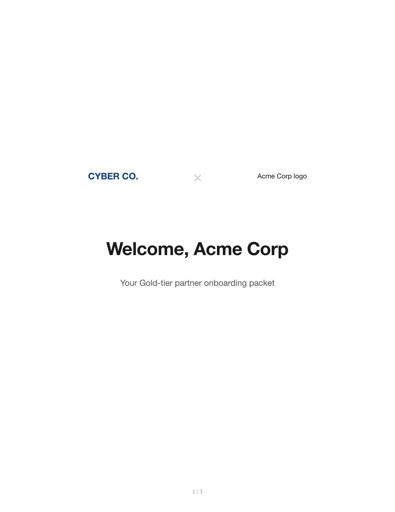
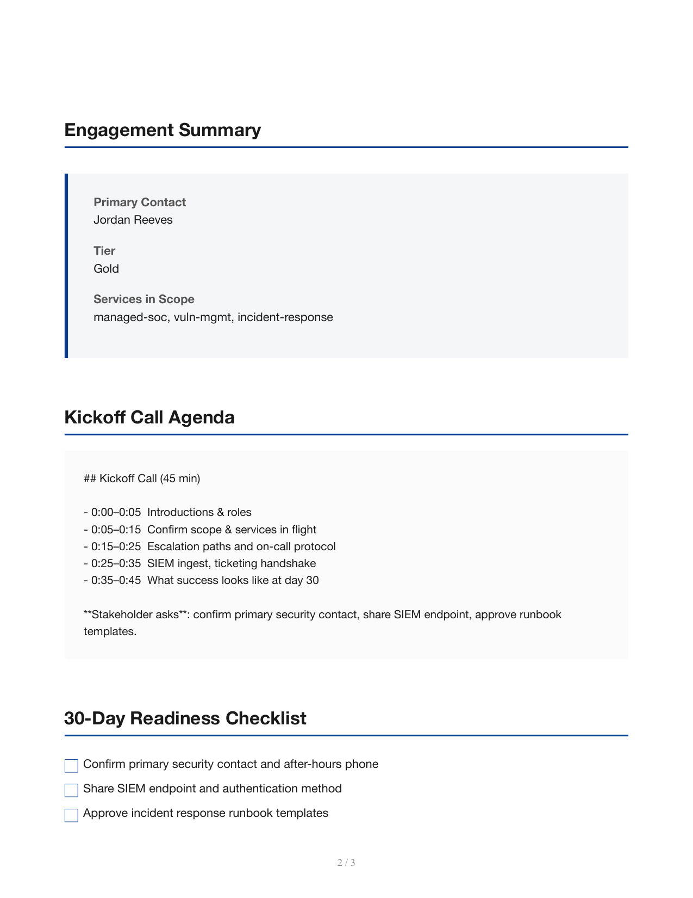
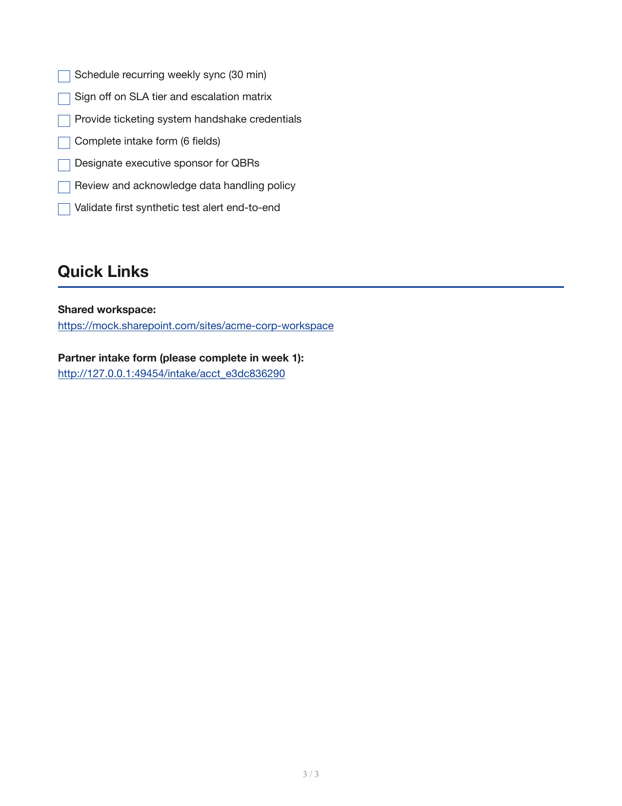
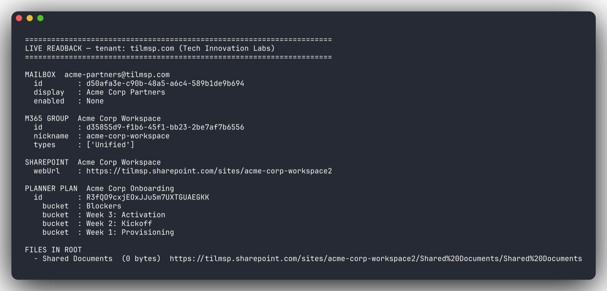

# partner-onboarding-agent

LangGraph agent that takes a freshly signed B2B partner from contract to operational in under 2 hours. Zero manual handoffs between sales, ops, and support.


A single closed-won HubSpot deal becomes: a provisioned M365 mailbox + SharePoint site + Planner board, a Zendesk org with the right SLA tier, an internal portal account, an AI-generated welcome email sequence + kickoff agenda + 30-day readiness checklist, and a co-branded PDF welcome packet — uploaded to both the portal and SharePoint, with a summary note posted back to the deal.

### Co-branded welcome packet (auto-generated per partner)

<p>
  
  
  
</p>

### Verified against a real Microsoft 365 tenant

Live readback from the production tenant, after the agent ran end-to-end with `B2B_USE_MOCKS=false`. Mailbox, M365 group, SharePoint site, Planner board (with all four buckets) and the uploaded PDF are all real Graph resources, addressable by their IDs in the screenshot below.



## What it does

When a HubSpot deal flips to **Closed Won**, the agent:

1. Reads partner profile (tier, region, services purchased) from HubSpot
2. Provisions a shared mailbox in Microsoft 365
3. Creates a SharePoint site (via M365 group) for shared documents
4. Spins up a Planner board with onboarding buckets
5. Creates a Zendesk organization + attaches the right SLA policy for the tier
6. Provisions an account in the internal portal (mocked here) and an intake form
7. Generates a co-branded PDF welcome packet (HTML + WeasyPrint) and uploads it
8. Generates a 5-touch welcome email sequence + kickoff call agenda + 30/60/90 readiness checklist
9. Posts a summary note back to the HubSpot deal

State is checkpointed via LangGraph's SQLite checkpointer so a stalled run can be resumed.

## Architecture

```
HubSpot webhook ──► FastAPI receiver ──► enqueue ──► LangGraph run
                                                          │
                          ┌───────────────────────────────┴───────────────────┐
                          ▼                                                   ▼
                read_partner_profile                              generate_content (LLM)
                          │                                                   │
                provision_m365 (mailbox → site → planner)             pdf_packet
                          │                                                   │
                provision_zendesk                                      upload_assets
                          │                                                   │
                provision_portal ─────► (FastAPI mock server)
                          │
                post_back_to_hubspot
```

## Quick start

```bash
# 1. Install both packages
cd ../b2b-agent-toolkit && pip install -e ".[dev]" && cd -
pip install -e ".[dev]"

cp .env.example .env
# add ANTHROPIC_API_KEY; leave B2B_USE_MOCKS=true for the demo

# 2. Run the mock portal in one terminal
mock-portal

# 3. Trigger an onboarding run in another
onboard run --deal-id deal-001
```

You'll get a PDF welcome packet at `out/<partner>-welcome-packet.pdf` and a JSON event log in `out/<run-id>.json`.

## Going to production

- Set `B2B_USE_MOCKS=false` and fill in the M365 / HubSpot / Zendesk creds in `.env`
- Replace `B2B_PORTAL_BASE_URL` with the real portal URL
- Wire the `/webhook/hubspot/deal-stage-changed` endpoint to your HubSpot account
- Swap the SQLite checkpointer for Postgres in `src/onboarding/graph.py`

## Layout

```
src/onboarding/
├── state.py            # OnboardingState (LangGraph TypedDict)
├── graph.py            # StateGraph wiring + compile
├── nodes.py            # provisioning nodes (one per integration)
├── content.py          # LLM-generated welcome email, agenda, checklist
├── pdf.py              # Jinja2 + WeasyPrint co-branded packet
├── webhook.py          # FastAPI receiver for HubSpot
└── cli.py              # Typer CLI: `onboard run --deal-id ...`
mock_portal/
├── main.py             # FastAPI mock of the internal portal API
└── store.py            # in-memory state
templates/
└── welcome_packet.html # branded packet template
```
